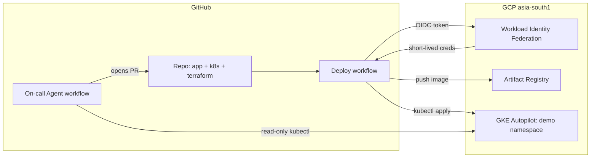

# GKE Self-Healing Cluster with a Claude Code On-Call Agent

A GKE Autopilot cluster provisioned entirely from Terraform, deployed to by a keyless GitHub Actions pipeline, and watched over by an AI on-call agent (Claude Code) that diagnoses incidents with read-only `kubectl` and proposes fixes as pull requests — never by touching the cluster directly.

Built in one day as a hands-on exercise: I've worked in a fully agentic DevOps workflow for the past year, and I wanted to prove to myself I could still build the fundamentals — Terraform, GKE, Workload Identity, CI/CD — from scratch, and then put an agent on top with proper guardrails.

## Architecture



**The incident loop:**

1. A bad change lands on `main` → deploy workflow rolls it out → rollout gets stuck.
2. A human (or, in a future iteration, Alertmanager) triggers the **On-call Agent** workflow with a one-line symptom.
3. Claude Code runs headless on the GitHub Actions runner. It investigates the `demo` namespace using **read-only** `kubectl` (`get`, `describe`, `logs`), identifies the root cause, edits the relevant manifest under `k8s/`, pushes a `fix/agent-<run-id>` branch, and opens a PR with the root cause, evidence, and fix.
4. A human reviews and merges the PR → the deploy workflow ships the fix → the cluster heals.

The agent **cannot** modify the cluster. The fix always travels through git, review, and CI — the same path a human engineer's fix would.

## What's in here

| Path | What it is |
|---|---|
| `terraform/` | All GCP infrastructure: APIs, Artifact Registry, GKE Autopilot, service account, IAM, Workload Identity Federation |
| `app/` | Tiny Flask service with `/` and `/health` endpoints |
| `k8s/` | Namespace, Deployment (probes, resource requests/limits), Service |
| `.github/workflows/deploy.yaml` | Build → push to Artifact Registry → `kubectl apply` → rollout check |
| `.github/workflows/oncall-agent.yaml` | The AI on-call responder (manual dispatch with a `symptom` input) |
| `CLAUDE.md` | The agent's standing orders — what it may and may not do |

## Design decisions

**Terraform for everything on the GCP side.** Cluster, registry, IAM, and identity federation are 12 resources in three `.tf` files. Rebuilding the whole environment is one `terraform apply`; tearing it down at night to save credits is one `terraform destroy`. Nothing was created in the console.

**Keyless CI via Workload Identity Federation.** There is no service account JSON key anywhere — not in GitHub secrets, not on disk. GitHub Actions presents its OIDC token, GCP checks it against a provider whose `attribute_condition` pins it to exactly this repository, and exchanges it for short-lived credentials. Nothing long-lived to leak or rotate.

**The agent is read-only on the cluster, write-only through PRs.** `--allowedTools` scopes Claude Code to `kubectl get/describe/logs`, `git`, and `gh pr create`. It cannot `apply`, `delete`, `patch`, or `scale`. If the agent is wrong, the blast radius is a PR a human declines. This also means every agent action is auditable in git history, like any other engineer's work.

**GKE Autopilot over self-managed nodes.** Pay-per-pod, no node management, and closer to how teams actually run Kubernetes in production than a hand-rolled kubeadm cluster on a VM.

## Real incidents from the build (unedited)

### Incident 1: `ImagePullBackOff` on first deploy — fixed by me

First rollout: CI was green, image was in Artifact Registry, but every pod sat in `ImagePullBackOff`.

```
Failed to pull image "...": failed to authorize: 403 Forbidden
```

**Root cause:** GKE nodes pull images using the project's default compute service account, and on newer GCP projects that account gets no roles by default. The CI service account could *push* to Artifact Registry; the *nodes* couldn't *pull*.

**Fix (in Terraform, not the console):** grant `roles/artifactregistry.reader` to the default compute service account, `terraform apply`, delete the stuck pods. Rollout completed.

### Incident 2: readiness probe 404 — diagnosed and fixed by the agent

I deliberately broke the deployment: changed both probe paths from `/health` to `/healthz` (a route the app doesn't serve) and pushed. A valid manifest, a subtle bug — new pods started, failed readiness forever, got killed by the liveness probe, and the rollout stalled while the old ReplicaSet kept serving traffic.

Triggered the agent with: *"after the latest deploy, new demo-app pods never become ready and keep restarting; rollout is stuck."*

In about two minutes the agent:
- correlated pod events (`Readiness probe failed: HTTP 404`) with the manifest and the Flask routes,
- concluded: probes request `GET /healthz`, the app only serves `/health` → 404 → never Ready → liveness kills → crash loop,
- changed both probe paths back, pushed `fix/agent-33412603987`, and drafted the PR body with root cause, evidence, and fix.

Merged the PR → deploy workflow ran → new pods `1/1 Running`, old ones terminated. Loop closed.

### Incident 3 (a good failure): the agent hit a permission wall and stopped

On its first successful diagnosis, the agent couldn't open the PR: the repo had GitHub's default *"Allow GitHub Actions to create and approve pull requests"* setting disabled. The agent pushed the branch, reported the exact blocker, provided the `gh pr create` command for a maintainer, and **stopped** — it didn't try to work around the restriction. That's exactly the behavior you want from an autonomous responder. (Setting enabled since.)

Other bumps along the way, kept for honesty: an OAuth token pasted wrong (`401`), a `max-turns` limit burned by a missing `gke-gcloud-auth-plugin` on the runner (every `kubectl` call failed auth until `setup-gcloud` installed the plugin), and my first attempt at "breaking" the cluster was itself broken — I set a memory limit below the request, which the API server rejects, so the bad spec never reached the cluster at all.

## Run it yourself

Prereqs: `gcloud`, `terraform`, `kubectl`, `gh`; a GCP project with billing; a Claude subscription or API key.

```bash
# 1. Infrastructure
cd terraform
cat > terraform.tfvars <<EOF
project_id  = "YOUR_PROJECT_ID"
github_repo = "YOUR_GH_USERNAME/YOUR_REPO"
EOF
terraform init && terraform apply

# 2. GitHub secrets (values from `terraform output`)
gh secret set GCP_PROJECT_ID
gh secret set GCP_WIF_PROVIDER
gh secret set GCP_SA_EMAIL
gh secret set CLAUDE_CODE_OAUTH_TOKEN   # from `claude setup-token` (or use an API key)

# 3. Push to main — the deploy workflow builds and ships the app

# 4. Break something in k8s/, push, then summon the agent:
gh workflow run oncall-agent.yaml -f symptom="describe what's broken"
```

Also enable **Settings → Actions → General → Allow GitHub Actions to create and approve pull requests.**

Tear-down: `kubectl delete namespace demo && terraform destroy`.

## What I'd add next

- **Alertmanager → agent**: replace manual dispatch with a Prometheus alert webhook so incidents summon the agent automatically.
- **Argo CD** for GitOps-style sync instead of `kubectl apply` in CI.
- **Multi-environment Terraform** (dev/prod from the same modules, separate tfvars).
- **MTTR dashboard**: measure detection-to-merge time per incident.
- **Post-incident reports**: have the agent append a short RCA to an `incidents/` folder on every PR.
